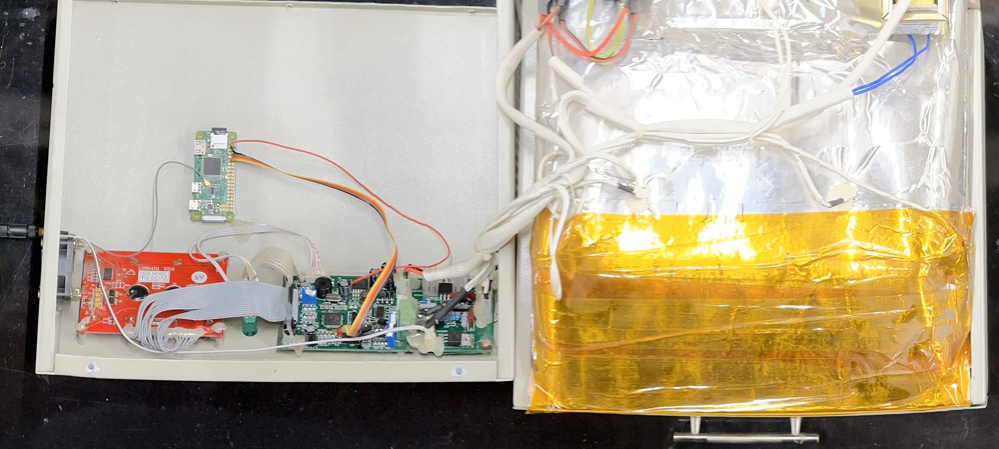
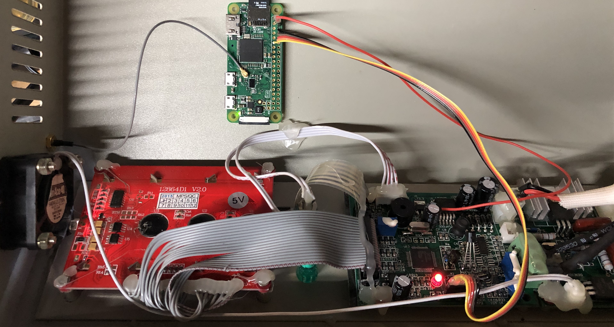
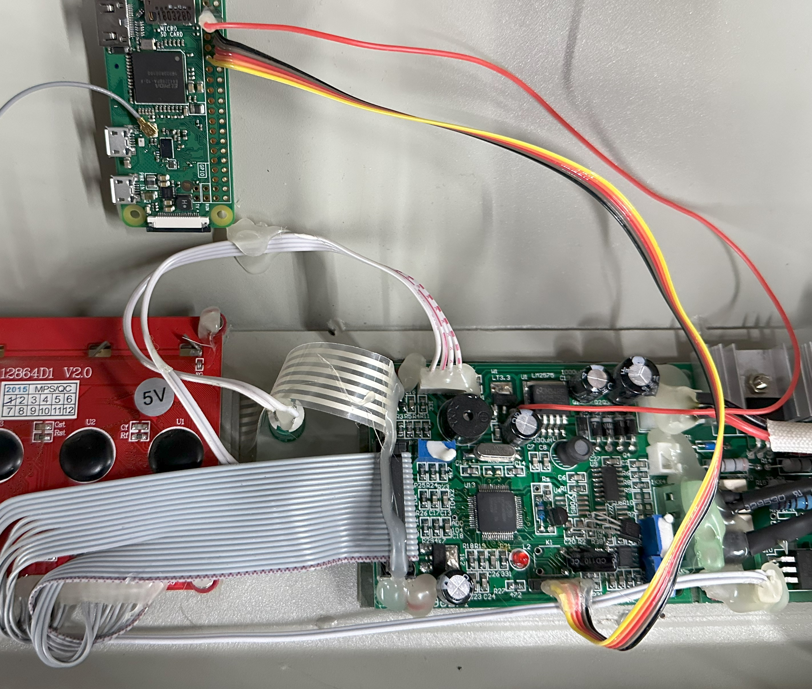

# Toaster

A simple web dashboard for my SMT reflow oven (T-962 + Raspberry Pi)

## First time setup

1. Install [Raspberry Pi OS](https://www.raspberrypi.com/software/) on your Raspberry Pi
2. Setup [access to your Pi](https://www.raspberrypi.com/documentation/computers/remote-access.html) via SSH with a private key
3. Run `npm i` (`npm install`) locally to install dependencies locally
4. Run `npm start` to deploy the app to your Pi

## Development

### Develop alongside [RDT](https://github.com/cinderblock/rdt)

1. Run `npm i` in both the `toaster` and `rdt` directories to set them up
   - Run `npm run watch` in `rdt` to build continuously
2. Replace dist package in `node_modules/@cinderblock/rdt` with a symlink to your local `rdt/.dist` directory
   - Linux
   ```
   rm -rf node_modules/@cinderblock/rdt
   ln -s ~/path/to/rdt node_modules/@cinderblock/rdt
   ```
   - Windows _(PowerShell, [ensure "Developer Mode" is enabled](https://learn.microsoft.com/en-us/windows/apps/get-started/enable-your-device-for-development#activate-developer-mode))_
   ```
   rm -r -fo node_modules/@cinderblock/rdt
   $null = New-Item -ItemType Junction -Path node_modules/@cinderblock/rdt -Value ~/path/to/rdt/.dist
   ```

## Hardware Connections

Following the hardware improvements from [Unified Engineering](https://github.com/UnifiedEngineering/T-962-improvements), we also add a Raspberry Pi Zero W to the oven to control it.
The `lpc-flash` library can also handle flashing the latest firmware on startup to ensure a consistent state.

By adding a U.FL connector to the Pi, we can use a "U.FL to SMA adapter" to add an external antenna to the oven.
This allows us to place the Pi inside of the oven, and still have a reliable WiFi connection.







### Raspberry Pi Zero W Connections

| Oven       | Description  | Pi # | GPIO | Wire Color |
| ---------- | ------------ | ---- | ---- | ---------- |
| **Ribbon** |              |      |      |            |
| 1          | `n_ISP`      | 11   | 17   | Yellow     |
| 2          | `n_RESET`    | 12   | 18   | Orange     |
| 3          | Device ➡️ Pi | 10   | 15   | Red        |
| 4          | Device ⬅️ Pi | 8    | 14   | Brown      |
| 5          | `GND`        | 6    |      | Black      |
| **Other**  |              |      |      |            |
| _5V_       | 5V Supply    | 4    |      | Red        |
